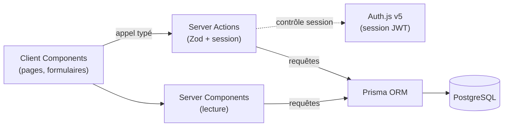
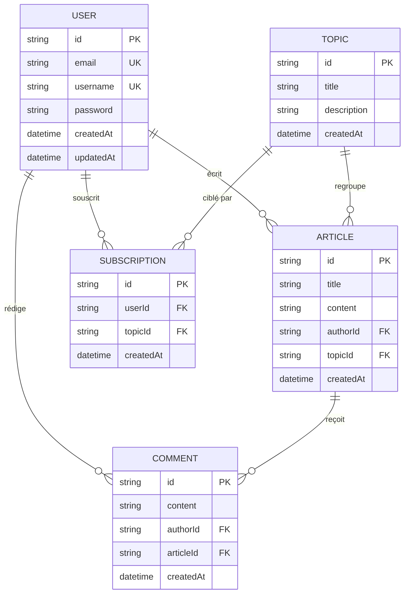

Auteur : \[Nom et prénom de l'étudiant\]

Version : 0.0.1

Date : 29/05/2026

**Version 0.0.1**

# **Documentation et rapport du projet MDD**

## **Sommaire**

1. Présentation générale du projet
   1.1 Objectifs du projet
   1.2 Périmètre fonctionnel
2. Architecture et conception technique
   2.1 Schéma global de l'architecture
   2.2 Choix techniques
   2.3 API (Server Actions) et schémas de données
3. Tests, performance et qualité
   3.1 Stratégie de test
   3.2 Rapport de performance et optimisation
   3.3 Revue technique
4. Documentation utilisateur et supervision
   4.1 FAQ utilisateur
   4.2 Supervision et tâches déléguées à l'IA
5. **Annexes**

---

## **1\. Présentation générale du projet**

### **1.1 Objectifs du projet**

**But du projet.** MDD (Monde de Dév) est un réseau social destiné aux développeurs, édité par l'entreprise ORION. Il permet à ses membres de s'abonner à des thèmes du monde de la programmation, de publier des articles sur ces thèmes et d'échanger via des commentaires.

**Contexte et valeur ajoutée.** ORION souhaite mettre en relation les développeurs et favoriser le partage de connaissances et la collaboration entre pairs. À terme, MDD pourrait constituer un vivier de profils pour le recrutement. Avant un lancement grand public, l'entreprise valide le concept via une version **MVP** (Minimum Viable Product) déployée en interne ; les choix techniques retenus pour le MVP seront conservés pour les versions suivantes s'il atteint ses objectifs.

**Principales fonctionnalités.**

* Comptes utilisateurs et authentification sécurisée ;
* abonnement / désabonnement à des thèmes ;
* publication et consultation d'articles ;
* commentaires sur les articles ;
* fil d'actualité personnalisé (articles des thèmes suivis).

### **1.2 Périmètre fonctionnel**

Le périmètre du MVP est défini par les spécifications fonctionnelles. Il ne comprend **pas de back-office** (zone d'administration). Au terme de l'étape de tests, chaque fonctionnalité est implémentée, conforme aux maquettes, branchée sur l'authentification réelle (Auth.js) et couverte par des tests (unitaires et/ou end-to-end).

| Fonctionnalité | Description | Statut |
| :---- | :---- | :---- |
| Création de compte | Inscription par e-mail, nom d'utilisateur et mot de passe (validation Zod) | Terminée |
| Authentification | Connexion par e-mail **ou** nom d'utilisateur, session persistante, déconnexion (Auth.js / JWT) | Terminée |
| Gestion du profil | Consulter et modifier e-mail, nom d'utilisateur et mot de passe | Terminée |
| Abonnements | Lister les thèmes, s'abonner, se désabonner | Terminée |
| Publication d'articles | Créer un article (thème, titre, contenu) et le consulter | Terminée |
| Fil d'actualité | Articles des thèmes suivis, triables du plus récent au plus ancien et inversement | Terminée |
| Commentaires | Ajouter un commentaire à un article (non récursif) | Terminée |

---

## **2\. Architecture et conception technique**

### **2.1 Schéma global de l'architecture**

MDD est une application **full-stack Next.js (App Router)** : le même projet héberge le front-end (React) et la logique serveur. Les couches sont :

* **Client Components** (`'use client'`) : pages interactives et formulaires, exécutés dans le navigateur ;
* **Server Components** : rendu côté serveur des pages de lecture (fil, thèmes, profil), sans JavaScript inutile envoyé au client ;
* **Server Actions** (`'use server'`) : point d'entrée de la logique métier (« l'API »). Chaque action valide ses entrées avec **Zod** et vérifie la **session** avant toute opération ;
* **Auth.js v5** : authentification et session (JWT), protection des routes via le middleware ;
* **Prisma ORM → PostgreSQL** : accès aux données typé.



**Légende.** Les traits pleins représentent le flux de données principal (lecture via les Server Components, mutations via les Server Actions) ; le trait pointillé représente le contrôle d'authentification. La logique métier n'expose aucune API REST : les Server Actions tiennent ce rôle. Le seul Route Handler du projet est celui d'Auth.js (`/api/auth/[...nextauth]`), imposé par la librairie pour ses endpoints internes d'authentification (voir section 2.3).

**Organisation technique (feature-based).** Le code est regroupé par domaine métier plutôt que par type technique :

```
app/                 routes (App Router) et pages
features/            logique par domaine (auth, themes, articles, profile)
  <feature>/         composants, Server Actions et schémas Zod du domaine
lib/                 utilitaires transverses (client Prisma, helpers)
prisma/              schema.prisma, migrations, seed
```

#### Conformité aux contraintes : séparation back/front et sécurité

* **Séparation back/front : logique, pas physique.** La distinction n'est pas un déploiement séparé mais une frontière stricte serveur/client propre à Next.js : Server Components et Server Actions s'exécutent uniquement sur le serveur, les Client Components dans le navigateur. Le code back-end (accès BDD, secrets) n'est jamais envoyé au client.
* **« Une API permet l'interaction » : ce sont les Server Actions.** Elles constituent le point d'entrée typé par lequel le front sollicite le back — l'équivalent des endpoints d'une API REST, sans couche HTTP métier à écrire et maintenir. (Le seul Route Handler est celui d'Auth.js, dédié à l'authentification, pas à la logique métier.)
* **Interaction sécurisée.** Chaque Server Action est une frontière de confiance : validation Zod des entrées, contrôle de session (Auth.js) avant toute opération, secrets et connexion BDD jamais exposés au client. Les bonnes pratiques de sécurité Next.js (`nextjs.org/docs/security`) sont suivies.
* **SOLID / Clean Code.** Appliqués à l'implémentation (architecture feature-based, schémas Zod centralisés, format de retour homogène `ActionResult`) et vérifiés lors de la revue technique (section 3.3).

### **2.2 Choix techniques**

Les éléments **imposés** par les contraintes techniques ORION sont indiqués comme tels (non soumis à arbitrage). Les choix **décidés** font l'objet d'une analyse comparative détaillée au paragraphe « Alternatives & arbitrages ».

| Éléments choisis | Type | Lien documentation | Objectif du choix | Justification |
| :---- | :---- | :---- | :---- | :---- |
| **Next.js 16 (App Router)** | Framework full-stack | [docs](https://nextjs.org/docs) | Unifier front + back (Server Components, Server Actions) | **Imposé par ORION.** Une seule stack à opérer ; rendu serveur et logique métier sans API séparée. |
| **TypeScript 5** | Langage | [docs](https://www.typescriptlang.org/docs) | Typage statique de bout en bout | **Imposé par ORION.** Types partagés Prisma → Server Actions → UI, refactor sécurisé. |
| **Node.js 22 LTS** | Runtime | [docs](https://nodejs.org/docs) | Moteur d'exécution serveur | **Imposé par ORION.** |
| **Prisma ORM** | ORM / accès BDD | [docs](https://www.prisma.io/docs) | Accès BDD typé + migrations | **Imposé par ORION** (« Prisma plutôt que des requêtes SQL brutes »). |
| **PostgreSQL** | Base de données | [docs](https://www.postgresql.org/docs) | Stockage relationnel | **Décidé** — données fortement relationnelles + contrainte d'unicité (voir arbitrages). |
| **Server Actions** | Couche « API » | [docs](https://nextjs.org/docs/app/getting-started/updating-data) | Interaction front/back typée et sécurisée | **Décidé** — supprime la couche HTTP ; validation + session à la frontière (voir arbitrages). |
| **Auth.js v5 (NextAuth)** | Authentification | [docs](https://authjs.dev) | Sessions sécurisées | **Décidé** — Credentials + JWT, cookie persistant (voir arbitrages). |
| **Zod** | Validation / schémas | [docs](https://zod.dev) | Valider les entrées et inférer les types | **Décidé** — schéma = source de vérité, réutilisable front/back. |
| **bcryptjs** | Hachage mot de passe | [docs](https://www.npmjs.com/package/bcryptjs) | Stocker les mots de passe de façon sûre | **Décidé** — algorithme bcrypt en JavaScript pur, sans compilation native (voir arbitrages). |
| **Tailwind CSS 4 + shadcn/ui** | UI / styling | [docs](https://ui.shadcn.com) | Design system + responsive | **Conservé** (présent dans le starter) — composants possédés, accessibilité Radix (voir arbitrages). |
| **Vitest + Testing Library + Playwright** | Tests | [docs](https://vitest.dev) | Tests unitaires / composant / e2e | **Décidé** — Supertest écarté, pas d'API REST à tester (voir arbitrages). |
| **Architecture feature-based** | Organisation du code | — | Regrouper par domaine métier | **Décidé** — cohésion, faible couplage (voir arbitrages). |
| **Prisma Migrate** | Migrations BDD | [docs](https://www.prisma.io/docs/orm/prisma-migrate) | Migrations versionnées | **Décidé** — historique de schéma reproductible (voir arbitrages). |

#### Alternatives & arbitrages (choix décidés)

**Server Actions** *(vs Route Handlers REST, tRPC, GraphQL, API Express/NestJS séparée)*

* *Avantages :* aucune couche de transport à écrire (routes, contrôleurs, fetchers, sérialisation JSON, DTOs) — l'action s'appelle comme une fonction depuis le composant ; typage de bout en bout natif (les types TS traversent client→serveur sans génération de code, contrairement à REST ou GraphQL) ; intégration formulaire (`useActionState`, `<form action={...}>`) fonctionnant même sans JavaScript (progressive enhancement) ; revalidation de cache intégrée (`revalidatePath` / `revalidateTag`) après mutation ; validation Zod et contrôle de session concentrés au même endroit (`'use server'`).
* *Inconvénients :* couplage fort à Next.js (non réutilisable tel quel par un client tiers ou mobile sans ajouter une API) ; pas de surface HTTP documentable/testable avec des outils REST (Supertest, Postman) ; modèle récent avec des pièges (arguments sérialisés, actions exposées comme endpoints POST → toujours valider et vérifier l'autorisation).
* *Pourquoi ce choix :* pour un MVP interne à client unique (le front Next.js), une couche REST n'ajoute que du code et de la surface d'attaque. tRPC et GraphQL répondraient au besoin de typage mais introduisent une dépendance et un outillage disproportionnés à cette échelle ; une API séparée (Express/Nest) contredirait la stack unifiée imposée.

**React Server Components** *(vs tout en Client Components / SPA classique)*

* *Avantages :* le rendu et l'accès aux données se font côté serveur → moins de JavaScript envoyé au client, pas d'endpoint de lecture à exposer, secrets et connexion BDD jamais présents dans le navigateur, meilleur TTFB et SEO.
* *Inconvénients :* frontière client/serveur à maîtriser (un Server Component ne peut pas utiliser `useState`/`onClick`) ; risque de cascades de requêtes (« waterfalls ») si mal composé ; modèle mental nouveau.
* *Pourquoi ce choix :* les écrans de MDD sont surtout de la lecture (fil, thèmes, profil, détail d'article) → idéaux en RSC ; on isole l'interactif (formulaires, menu mobile, bouton « s'abonner ») en Client Components. Une SPA tout-client multiplierait les endpoints et le poids JS pour un faible bénéfice.

**PostgreSQL** *(vs MySQL, SQLite, MongoDB)*

* *Avantages :* relationnel robuste, MVCC avec verrouillage par ligne (nombreuses écritures concurrentes), typage strict, contraintes riches (FK, `UNIQUE`, `CHECK`, index partiels/fonctionnels), types avancés (UUID, `citext`, `enum`, JSONB), support Prisma le plus complet.
* *Inconvénients :* nécessite un serveur (Docker en local), un peu plus à opérer que SQLite.
* *Pourquoi ce choix :* **SQLite écarté** — verrou d'écriture au niveau de la base (un seul writer), FK désactivées par défaut et typage laxiste → inadapté à une application web multi-utilisateurs en production (il reste excellent pour l'embarqué/le prototypage). **MongoDB écarté** — données fortement relationnelles avec jointures (le fil = articles des thèmes suivis), un SGBD relationnel est plus naturel. **MySQL ferait aussi bien le travail** ; on tranche en faveur de Postgres pour sa rigueur (contraintes/typage), le contrôle explicite de l'unicité insensible à la casse pour l'e-mail et le nom d'utilisateur (`citext` ou index `lower()`) et son intégration dans l'écosystème Next.js/Prisma.
* *Note :* on garde **le même moteur en test et en production** (pas de SQLite pour les tests) afin d'éviter les écarts de comportement entre environnements (les fonctionnalités diffèrent, ex. les `enum` non supportés par SQLite avec Prisma).

**Auth.js v5 — Credentials + JWT** *(vs auth maison jose+cookies, Lucia, Clerk/Auth0, Supabase Auth, Better Auth)*

* *Avantages :* librairie auditée qui gère les points sensibles (signature et rotation des tokens, protection CSRF, cookies `httpOnly`/`secure`, callbacks), middleware de protection des routes, intégration Next.js native.
* *Inconvénients :* API v5 récente et documentation Credentials moins fournie que pour les providers OAuth ; comportement « boîte noire » à comprendre pour le défendre ; révocation de session moins immédiate qu'avec des sessions en base (un JWT reste valide jusqu'à son expiration).
* *Pourquoi ce choix :* on ne réimplémente pas soi-même la sécurité (source d'erreurs). La stratégie **JWT** (cookie signé) assure la persistance entre sessions **sans table ni store serveur** → modèle et infrastructure allégés, cohérent avec la consigne « ne pas surcomplexifier la sécurité ». Le provider **Credentials** correspond au besoin (e-mail/nom d'utilisateur + mot de passe, pas d'OAuth tiers). Les solutions SaaS (Clerk, Auth0) sont écartées (dépendance externe et données utilisateurs hors de notre base pour un simple MVP interne) ; une auth maison ou Lucia donnerait plus de contrôle mais beaucoup plus de code de sécurité à écrire et à défendre.
* *Note :* pour la révocation, on peut maintenir des durées de session courtes ; passer à des sessions en base reste une évolution possible si une révocation immédiate devient nécessaire.

**Zod** *(vs Yup, Joi, class-validator + DTOs, validation manuelle)*

* *Avantages :* un schéma valide à l'exécution **et** infère le type TypeScript (`z.infer`) → une seule source de vérité ; réutilisable côté client (retour de formulaire) et serveur (frontière de confiance des Server Actions) ; erreurs structurées (`fieldErrors`) ; composition (`.refine`, `.merge`).
* *Inconvénients :* validation au runtime (coût négligeable ici), schémas parfois verbeux, dépendance supplémentaire.
* *Pourquoi ce choix :* élimine la double déclaration « type + validateur » (Yup/Joi ne fournissent pas le type ; class-validator impose des classes/DTOs et des décorateurs). Centralise les règles métier (mot de passe ≥ 8 caractères avec chiffre/minuscule/majuscule/spécial, formats e-mail et nom d'utilisateur). Déjà présent dans le starter et reconnu dans l'écosystème comme remplaçant des DTOs.

**bcryptjs** *(vs bcrypt natif, argon2, scrypt)*

* *Avantages :* algorithme bcrypt (dérivation lente, sel intégré, facteur de coût ajustable → résiste au brute-force) en **JavaScript pur**, donc **aucune compilation native** (`node-gyp`) → installation fiable sur tout environnement, compatible avec les tests (Vitest) et le edge runtime ; API simple (`hash` / `compare`).
* *Inconvénients :* légèrement plus lent que l'implémentation native `bcrypt` ; argon2id est aujourd'hui le premier choix recommandé par l'OWASP (résistance « mémoire-hard ») ; bcrypt tronque au-delà de 72 octets.
* *Pourquoi ce choix :* le paquet natif `bcrypt` impose une compilation native parfois capricieuse selon la machine ; `bcryptjs` offre le même algorithme sans cette contrainte, ce qui simplifie l'installation et les tests pour un MVP. argon2 est documenté comme axe d'amélioration. (Règle non négociable : jamais de mot de passe en clair ni de hash rapide type SHA-256.)

**Tailwind CSS 4 + shadcn/ui** *(conservé du starter — vs CSS Modules, MUI, Chakra UI, styled-components)*

* *Avantages :* shadcn fournit des composants **copiés dans le repo** (code possédé et adaptable, pas de dépendance UI fermée) bâtis sur Radix → accessibilité clavier/ARIA native (sert l'exigence d'accessibilité) ; Tailwind permet une itération rapide et un responsive utilitaire (breakpoints) cohérent avec l'exigence multi-supports ; pas de CSS-in-JS au runtime.
* *Inconvénients :* HTML chargé en classes utilitaires (lisibilité) ; composants shadcn à maintenir soi-même (pas de mise à jour via npm) ; courbe d'apprentissage Tailwind.
* *Pourquoi ce choix :* déjà configuré dans le starter (thème violet posé) → cohérent à conserver et accélère l'intégration des maquettes Figma. MUI/Chakra imposeraient leur propre design system (moins fidèle aux maquettes) et un poids runtime ; styled-components ajoute du CSS-in-JS runtime peu adapté aux Server Components.

**Vitest + Testing Library + Playwright** *(vs Jest, Cypress ; Supertest exclu)*

* *Avantages :* Vitest réutilise la chaîne Vite/ESM/TS du projet (configuration quasi nulle, démarrage rapide, mode watch) ; React Testing Library teste les composants au plus près de l'usage (DOM, accessibilité) ; Playwright couvre l'e2e multi-navigateurs de façon fiable (auto-wait) sur les parcours critiques.
* *Inconvénients :* tests e2e plus lents et plus fragiles à maintenir ; trois outils à configurer.
* *Pourquoi ce choix :* couvre les trois niveaux attendus (unitaire, intégration, e2e). Jest est écarté car Vitest s'intègre mieux à un projet Vite/ESM. **Supertest est exclu techniquement** : il teste des endpoints HTTP, absents ici puisque les Server Actions n'exposent pas d'API REST → on teste les Server Actions directement en intégration (Vitest, en appelant la fonction sur une base de test) et les parcours via Playwright (qui exerce de fait la chaîne HTTP du navigateur).

**Architecture feature-based** *(vs layer-based par type technique, atomic design)*

* *Avantages :* co-localise tout ce qui concerne un domaine (UI + Server Actions + schémas Zod + types) → modifications localisées, faible couplage entre features, évolution par simple ajout d'un dossier ; onboarding plus simple (un dossier = une fonctionnalité).
* *Inconvénients :* quelques duplications possibles (helpers partagés à factoriser dans `lib`) ; conventions de découpage à tenir ; frontière feature/partagé parfois floue.
* *Pourquoi ce choix :* MDD se décompose naturellement en domaines (auth, themes, articles, profile). Le layer-based disperse une même fonctionnalité dans plusieurs dossiers techniques (on saute de `components/` à `services/`…). L'App Router impose déjà l'arborescence des routes dans `app/` ; on garde la logique métier regroupée dans `features/`.

**Prisma Migrate** *(vs `prisma db push`, migrations SQL manuelles)*

* *Avantages :* génère des fichiers de migration SQL **versionnés dans Git** → historique de schéma reproductible, déployable de façon déterministe (CI/production), revue de schéma possible en pull request.
* *Inconvénients :* un peu plus de cérémonie en développement (générer puis appliquer) ; conflits de migrations à gérer en équipe.
* *Pourquoi ce choix :* la base doit être cohérente et reproductible (étape 3 et production) ; `db push` convient au prototypage rapide mais ne laisse aucune trace → on retient Migrate pour un schéma traçable et déployable.

### **2.3 API (Server Actions) et schémas de données**

> Conception **prévisionnelle** (étape 2) ; la signature exacte des Server Actions sera confirmée à l'implémentation (étapes 4-5).

La logique métier est exposée via des **Server Actions**. Le projet ne comporte qu'**un seul Route Handler**, celui d'Auth.js (`app/api/auth/[...nextauth]/route.ts`, méthodes `GET` et `POST`) : il est **imposé par la librairie** pour ses endpoints internes (connexion, déconnexion, `callback`, `csrf`, `session`, `providers`) et ne contient aucune logique métier. Convention de retour homogène pour les mutations : `ActionResult<T> = { success: true; data: T } | { success: false; error: string; fieldErrors?: Record<string, string> }`.

| Server Action | Type | Description | Retour / Réponse |
| :---- | :---- | :---- | :---- |
| `registerUser` | Mutation | Créer un compte (e-mail, nom d'utilisateur, mot de passe validé Zod et haché) | `ActionResult<{ userId }>` |
| `signIn` / `signOut` | Mutation | Connexion (e-mail **ou** nom d'utilisateur) / déconnexion via Auth.js | Session (cookie JWT) |
| `getCurrentProfile` | Query | Profil de l'utilisateur connecté + abonnements | `User` (sans mot de passe) |
| `updateProfile` | Mutation | Modifier e-mail / nom d'utilisateur / mot de passe | `ActionResult<User>` |
| `getTopics` | Query | Liste de tous les thèmes + état d'abonnement de l'utilisateur | `Topic[]` |
| `subscribe` / `unsubscribe` | Mutation | S'abonner / se désabonner à un thème | `ActionResult` |
| `getFeed` | Query | Fil des articles des abonnements, trié (récent / ancien) | `Article[]` |
| `getArticle` | Query | Détail d'un article + commentaires | `Article & { comments }` |
| `createArticle` | Mutation | Créer un article (thème, titre, contenu ; auteur + date automatiques) | `ActionResult<{ articleId }>` |
| `addComment` | Mutation | Ajouter un commentaire (contenu ; auteur + date automatiques) | `ActionResult` |

**Modèle de données (Prisma).**



Remarques :

* Pas de tables `Account` / `Session` : la stratégie **JWT** d'Auth.js stocke la session dans un cookie signé (pas d'adapter Prisma requis).
* `Subscription` porte une contrainte d'unicité `@@unique([userId, topicId])` (un seul abonnement par couple utilisateur/thème).
* Les thèmes (`Topic`) n'ayant pas de back-office, ils sont insérés via un **script de seed**.
* Suppressions en cascade à définir (ex. supprimer un article supprime ses commentaires).

---

## **3\. Tests, performance et qualité**

### **3.1 Stratégie de test**

La stratégie repose sur **deux niveaux complémentaires**, chacun ciblant ce qu'il vérifie le mieux :

* **Tests unitaires / d'intégration (Vitest + React Testing Library).** Ils ciblent la **logique métier** isolément : Server Actions de mutation, schémas de validation Zod, autorisation, transformation des données et helpers, ainsi que quelques composants Client au plus près de l'usage (DOM, accessibilité). L'accès à la base est **simulé** (mock Prisma via `vitest-mock-extended`) pour des tests rapides et déterministes, sans dépendance externe.
* **Tests end-to-end (Playwright).** Ils exercent les **parcours utilisateur réels** dans un navigateur (Chromium), de l'interface jusqu'à la base de données, sur une **base de test isolée** (conteneur PostgreSQL dédié, distinct de la base de développement) **réinitialisée avant chaque exécution** (`prisma migrate reset` + seed). C'est ce niveau qui valide concrètement la chaîne front → Server Action → Prisma → PostgreSQL.

**Pourquoi ce découpage.** Les Server Actions n'exposant pas d'API REST, il n'y a pas d'endpoint HTTP à tester avec un outil type Supertest (cf. arbitrage § 2.2) : on teste donc la logique métier directement en unitaire, et la chaîne HTTP réelle via Playwright. Le périmètre de **couverture** est volontairement **concentré sur la logique métier** (et non sur les pages ou le code d'authentification, couverts par l'e2e), afin de mesurer ce qui a une réelle valeur de non-régression plutôt qu'un pourcentage global artificiel.

**Commandes.** `npm test` (unitaires), `npm run test:coverage` (couverture), `npm run test:e2e` (end-to-end).

| Type de test | Outil / framework | Portée | Résultats |
| :---- | :---- | :---- | :---- |
| Test unitaire / intégration | Vitest (+ mock Prisma) | Server Actions, validations Zod, autorisation, helpers | **61 tests** sur 11 fichiers — ✅ tous passants |
| Test de composant | React Testing Library | Composants Client (carte d'article, formulaire de commentaire) | Inclus dans les 61 tests — ✅ |
| Test e2e | Playwright (Chromium) | Inscription, connexion/déconnexion, refus de connexion, protection des routes, abonnement à un thème, création + consultation d'un article avec commentaire | **6 scénarios** — ✅ tous passants |

> **Couverture (logique métier).** Seuils exigés via `vitest.config.ts` : statements ≥ 85 %, branches ≥ 80 %, functions ≥ 85 %, lines ≥ 85 %. Le rapport HTML est généré par `npm run test:coverage` (voir annexes, § 5).

### **3.2 Rapport de performance et optimisation**

Décrivez les actions menées pour **améliorer la performance** du code et du rendu :

* résultats d'audit (Lighthouse, Vercel Analytics, etc.),
* points d'amélioration identifiés,
* actions correctives appliquées.

*Exemple : "Après audit Lighthouse, la performance est passée de 65 à 95/100 grâce à l'utilisation du composant Next/Image et au rendu statique partiel (PPR)."*

### **3.3 Revue technique**

Présentez une **synthèse critique du code** :

* points forts (structure, typage TypeScript, sécurité Zod),
* points à améliorer (complexité, dette technique),
* actions correctives appliquées.

*Exemple :*

* **Point fort :** Typage strict de bout en bout avec Prisma et TypeScript.
* **À améliorer :** Duplication de la logique de validation dans plusieurs Server Actions.
* **Action corrective :** Centralisation des schémas Zod dans un dossier lib/definitions.

---

## **4\. Documentation utilisateur et supervision**

### **4.1 FAQ utilisateur**

Rédigez une courte section d'aide destinée aux utilisateurs internes ou finaux. Structurez-la en format **Question / Réponse**.

Q : Comment créer un compte ?

R : Cliquez sur "S'inscrire", remplissez le formulaire et validez. Vous serez automatiquement connecté.

Q : Que faire si l'application ne charge pas ?

R : Rafraîchissez la page. Si le problème persiste, vérifiez votre connexion ou contactez le support technique.

### **4.2 Supervision et tâches déléguées à l'IA**

Décrivez les tâches confiées à l'IA ou à des collaborateurs juniors, et comment vous avez **revérifié, validé ou corrigé** leur travail.

| Tâche déléguée | Outil / collaborateur | Objectif | Vérification effectuée |
| :---- | :---- | :---- | :---- |
| Génération du script de seed des thèmes (`prisma/seed.ts`) | Claude | Gagner du temps sur une tâche répétitive (insertion des thèmes initiaux, sans back-office) | Relu le code (upsert idempotent sur `title`), exécuté `prisma db seed` puis vérifié en base que les thèmes étaient bien présents (`SELECT title FROM "Topic"`). Ajusté la liste et les descriptions des thèmes. |
| Génération des schémas de validation Zod (`lib/validations.ts`) | Claude | Gagner du temps sur la traduction des règles métier en schémas (mot de passe, inscription, connexion, profil, article, commentaire) | Relu chaque règle au regard des spécifications fonctionnelles (notamment la règle du mot de passe : ≥ 8 caractères avec chiffre, minuscule, majuscule et caractère spécial). Validé le typage (`tsc --noEmit`) ; bornes complémentaires (longueur des champs) définies manuellement. Tests unitaires prévus à l'étape de tests. |
| Génération d'articles de démonstration (`prisma/seed.ts`) | Claude | Peupler le fil d'actualité avec des contenus réalistes pour les tests et les captures d'écran | Relu les titres et contenus des articles, exécuté `prisma db seed` puis vérifié en base la présence des articles (un par thème principal). |

---

## **5\. Annexes**

Intégrez ici toutes les pièces justificatives :

* **Captures d'écran de l'UI** et vues principales.
* **Analyse des besoins front-end** (liens avec les spécifications ou maquettes).
* **Définition des données** (schémas Prisma, types TypeScript, règles Zod).
* **Rapports de couverture et de tests** (exports ou impressions d'écran).
* **Rapport de revue technique** (version complète, datée et signée si applicable).
